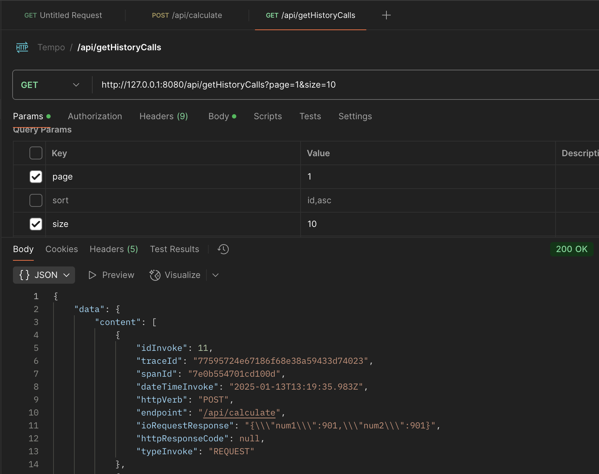
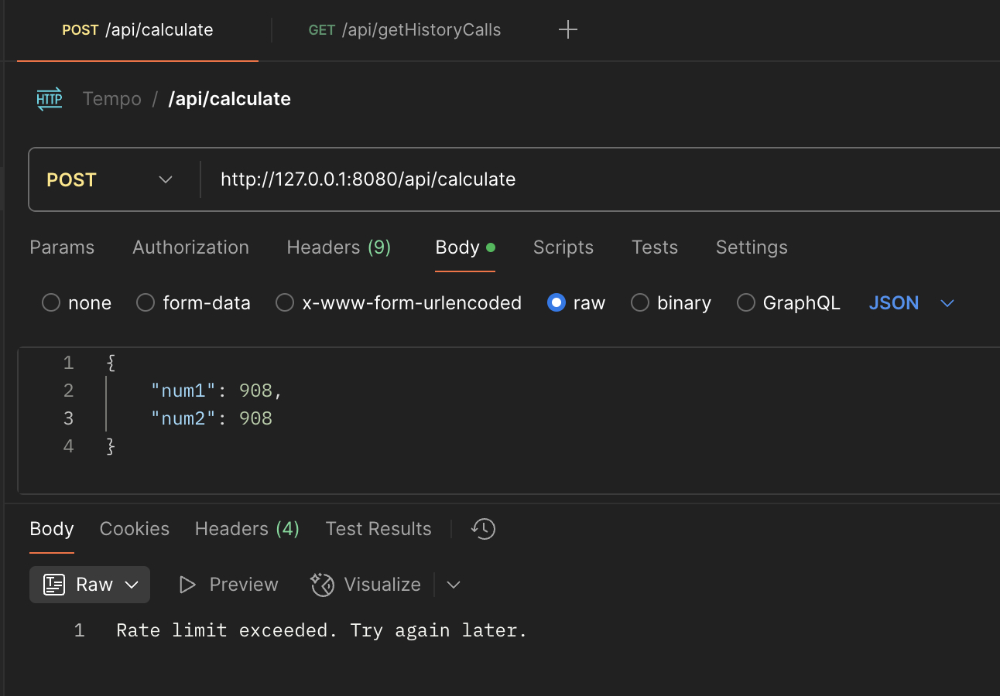

## Ejecución (Entorno Docker Compose)

### Contexto técnico Docker-Compose

Docker Compose es una herramienta fundamental para la orquestación de aplicaciones en contenedores, permitiendo definir y ejecutar múltiples contenedores de manera sencilla y eficiente. En un entorno donde la agilidad y la disponibilidad son cruciales, Docker Compose permite a los desarrolladores gestionar aplicaciones complejas usando un solo archivo de configuración **(docker-compose.yml)**. Este archivo facilita la definición de la infraestructura necesaria, incluyendo servicios, redes y volúmenes, promoviendo un flujo de trabajo más limpio y reproducible. Para ejecutar un proyecto usando Docker Compose, es esencial contar con Docker instalado en el sistema, así como una versión reciente de Docker Compose. La simpleza que ofrece al encapsular todas las dependencias y configuraciones dentro de contenedores facilita el despliegue y la escalabilidad de las aplicaciones, eliminando problemas comunes de compatibilidad y permitiendo a los equipos enfocarse en el desarrollo de funcionalidades.

### Manos a la obra

Quiero destacar que no es necesario que configures nada para ejecutar esta proyecto, todo esta armado para que tu solo ejecutes los pasos que mencionamos y los contenedores harán su trabajo ya que traen sus propias intrucciones de configuración

**1. Clonar el repositorio:**
>git clone https://github.com/davidortizalbornoz/tenpo_challenge.git

Repositorio de código fuente:
https://github.com/davidortizalbornoz/tenpo_challenge.git

**2. Descarga de imaganes necesarias para el contenedor Base**

Nos posicionamos en el directorio base o raíz del proyecto donde clonamos el repositorio previamente.   Si todo va perfecto, deberíamos poder visualizar el recurso: **docker-compose.yml**

Esto descargará las imágenes necesarias
>docker-compose pull

* image: davidortizalbornoz/tempo-challenge:1.0.0
* image: dpage/pgadmin4:7.8
* image: redis:7.2.7-alpine3.21
* image: postgres:16-alpine3.20

Repositorio de Imagen DockerHub (app):
https://hub.docker.com/r/davidortizalbornoz/tempo-challenge

**3. Iniciar los contenedores:**

Este comando iniciará los contenedores:
>docker-compose up -d
* Aplicativo: SpringBoot 3.2.12 - Java 21
* Redis: 7.2.7
* Postgres: 16
* PgAdmin4: 7.8

## Contexto Funcional del Proyecto 

### Retroalimentación de caché

La instrucción dice textualmente:

_**El porcentaje obtenido del servicio externo debe almacenarse en memoria (caché) y considerarse válido durante 30 minutos**_

¿¿ Que hice al respecto ??:

1. Al momento de arranque del aplicativo, ejecutará una llamada al servicio Mock para obtener el porcentaje a aplicar.
2. Incorporé adicionalmente un proceso cíclico que se ejecutará cada 30 minutos para obtener el porcentaje desde el servicio Mock.
3. En cada llamada al servicio Mock este actualizará las claves en Redis:
4. Esto mantendrá siempre un flujo de actualización constante del caché 

Las claves que incorporaremos a Redis son las siguientes:

* FIXED_AMOUNT_TENPO = 35 (Expira en 30 minutos)
* LATEST = 35 (No tiene tiempo de expiración)

### Alternativas de obtención del porcentaje

El endpoint POST /api/calculate utiliza un monto (porcentaje) aplicable a la sumatoria de los dos numeros que soporta como entrada esta operación.

La priorización de obtención del monto de aplicable son las siguientes:

* La primera opción siempre será la clave Redis: "FIXED_AMOUNT_TENPO" (Se actualizará cada 30 mins)
* La segunda opción es una clave Redis que no tiene periodo de expiración: "LATEST"

En caso de no no estar disponible Redis o no existan las claves, la aplicación toma un valor por defecto.
Este valor se encuentra contenido dentro del recurso de propiedades (application.properties)

>app.fixed.percentage=30

Recordemos que existe un proceso ciclico que se ejecuta cada 30 minutos para obtener ese monto desde los servicios Mock, con esto actualiza las claves en Redis.

## Ejecución de endpoints del API

Para esto he incluido una colección postman con un ejemplo de ejecución de cada operación:

* POST /api/calculate
* GET /api/getHistoryCalls

