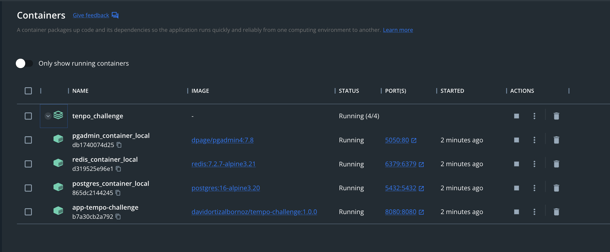

Repositorio de código fuente:
https://github.com/davidortizalbornoz/tenpo_challenge.git

Repositorio de Imagenes DockerHub:
https://hub.docker.com/r/davidortizalbornoz/tempo-challenge

# Entorno docker-compose

Nos posicionamos en el directorio base o raíz del proyecto

Esto descargará las imágenes necesarias
>docker-compose pull

* image: davidortizalbornoz/tempo-challenge:1.0.0
* image: dpage/pgadmin4:7.8
* image: redis:7.2.7-alpine3.21
* image: postgres:16-alpine3.20

Esto iniciará los contenedores:
>docker-compose up -d
* Aplicativo: SpringBoot 3.2.12 - Java 21
* Redis: 7.2.7
* Postgres: 16
* PgAdmin4: 7.8

